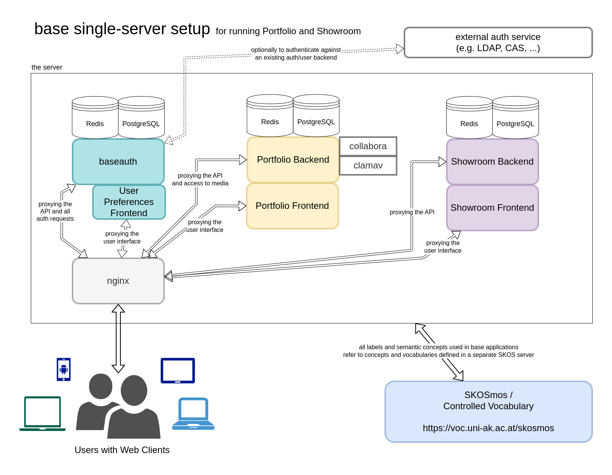

# Requirements

Depending on whether you want to set up a production, testing, or local development environment, there will be
different things you need to take care of. While the [](./local_dev_setup.md) is described in a separate section,
the following notes will focus on what is needed to get our applications running on a publicly reachable server,
either for testing purposes or to run in production.

The minimal setup needed, is a fresh Linux system, with [Docker](https://docs.docker.com/get-docker/) installed, and the `make` command available.
While in theory, this should run on any major Linux distribution, we suggest using [Debian](https://www.debian.org/),
or a Debian-based distro like [Ubuntu](https://ubuntu.com/). We usually test our applications only on Debian and Ubuntu.

The specific requirement and setup then depends on whether you want to:

- go for a single-server setup, where one machine is running all applications
- or a multi-server setup, where different machines host different (parts) of our applications

In any case we suggest to do the following on any server running any (parts) of our applications:

- install the [Docker Engine](https://docs.docker.com/engine/install/) for your specific distro
- install the `make` command (e.g. with `sudo apt install make`).
  ```{note}
  This holds only for minimal server setups. In more complex cases you might want to install the `build-essential`
  package instead (this will also install `make`). Especially in a local dev setup you will need it to manage
  python evironments. If you run into issues with building something on a test server, where you only installed
  `make`, try installing the `build-essential` first.
  ```
- for legacy reasons we currently need to also have the `docker-compose` command available, which was superseded by
  `docker compose`. If your specific docker installation provides both, you are all set. Otherwise, you can emulate
  the older _docker-compose_ command by doing the following:
  ```bash
  echo 'docker compose "$@"' | sudo tee /usr/local/bin/docker-compose
  sudo chmod +x /usr/local/bin/docker-compose
  ```

To decide which path to take from here, a requirement is to understand how our different applications work together.
The following diagram should help to explain this based on a single-server setup:


(full-size image: [](_static/single-server-architecture.drawio.png)
drawio source: [](_static/single-server-architecture.drawio))

All the single components shown inside the server block run on separate Docker containers, except for those frontend
parts that can be built to static sources once, which are then hosted directly by nginx. But also the building of these
static sources is done with a container. There are even some more containers in the final setup, which are not
explicitly shown here (e.g. the django job queue workers in Portfolio and Showroom), but they should be considered
an integral part of the respective backend component.

In case of a multi-server-setup, you can decide to take some parts, e.g. the _Portfolio_ frontend and backend, to be
hosted on a dedicated machine, similar to the _Showroom_ frontend and backend, while keeping _Baseauth_ on your main
machine serving as an entry point. In this case you will nevertheless need the _nginx_ component on every machine,
because it serves as the reverse proxy, distributing incoming HTTP requests to the respective containers providing
either frontend or backend services - as the containers themselves are not (and should not be) publicly accessible.
